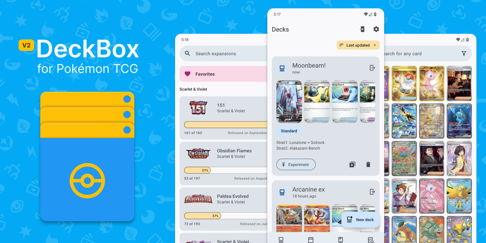

# DeckBox 2.0.0 (🚧 work-in-progress 🚧)

**DeckBox** is an unofficial deck building app for creating and managing your Pokémon TCG decklists. Whether you are building and tweaking the top decks in the meta or just experimenting with some spicy rogue decks, search through a large collection of Pokémon cards that span from the latest expansion all the way back to the base set

## This is a **WIP** re-write of DeckBox in the latest tech stack

* [Kotlin Multiplatform][kotlin-multiplatform]
* [Jetbrains Compose Multiplatform][compose-multiplatform]
* Presentation Architecture: [Slack's Circuit][slack-circuit]
* Networking: [Ktor Client][ktor]
* Storage
  * [SQLDelight][sql-delight]
  * [Store5][store]
* Dependency Injection
  * [kotlin-inject][kinject]
  * [kotlin-inject-merge](di/README.md)

_This re-write is largely inspired and based on [chrisbanes/tivi](https://github.com/chrisbanes/tivi) and it served as the launching point for this code base to get up and running on KMP/Compose_

## API

DeckBox is powered by [pokemontcg.io](https://pokemontcg.io)

**API:** [PokemonTCG/pokemon-tcg-api](https://github.com/PokemonTCG/pokemon-tcg-api)
**DATA:** [PokemonTCG/pokemon-tcg-data](https://github.com/PokemonTCG/pokemon-tcg-data)

[kotlin-multiplatform]: https://kotlinlang.org/docs/multiplatform.html
[compose-multiplatform]: https://www.jetbrains.com/lp/compose-multiplatform/
[slack-circuit]: https://slackhq.github.io/circuit/
[ktor]: https://ktor.io/docs/welcome.html
[sql-delight]: https://cashapp.github.io/sqldelight/2.0.0/multiplatform_sqlite/
[store]: https://github.com/MobileNativeFoundation/Store
[kinject]: https://github.com/evant/kotlin-inject

## Contributing

Please follow the guidelines set forth in the [CONTRIBUTING](CONTRIBUTING.md) document.

## License

GNU General Public License v3.0

See [LICENSE](LICENSE) to see the full text.
